# 互动测验系统 (Interactive Quiz System)

## 项目概述

这是一个基于 Node.js/Express 构建的现代化互动测验系统，旨在提供丰富多样的在线学习和测验体验。系统架构采用前后端分离设计，后端使用 Express 提供 RESTful API，前端通过原生 JavaScript 实现交互逻辑和动态渲染。

### 🚀 核心特性

- **多样化题型支持**：单选题、多选题、填空题、匹配题、判断题等多种题型全面覆盖
- **富媒体集成**：支持图片、视频、音频等多媒体内容，提供沉浸式学习体验
- **实时反馈**：即时答案验证和详细解析，帮助用户理解知识点
- **套题模式**：支持完整测验流程，包括作答、提交和成绩分析
- **响应式设计**：适配各种设备屏幕大小，提供一致的用户体验
- **可扩展题库**：基于 JSON 格式的题库设计，方便添加和管理题目
- **自动化测试**：内置 Playwright 自动化测试脚本，便于功能验证和文档生成

### 💡 应用场景

- 教育机构的在线测评系统
- 企业培训与技能评估
- 语言学习与测试
- 知识竞赛与互动问答
- 自学检测与进度跟踪

### 🔧 技术栈

- **后端**：Node.js + Express
- **前端**：HTML5 + CSS3 + JavaScript
- **数据存储**：JSON 文件作为轻量级数据库
- **自动化测试**：Playwright
- **部署**：支持 Docker 容器化部署（可选）

## 🚀 快速开始

### 前置条件

- Node.js (v12.0.0 或更高版本)
- npm (v6.0.0 或更高版本)

### 安装与运行

```bash
# 克隆项目
git clone https://github.com/yourusername/interactive-quiz-system.git
cd interactive-quiz-system

# 安装依赖
npm install

# 启动服务器
node server.js

# 访问系统
# 浏览器打开: http://localhost:7000
```

### 题库管理

- 所有题库文件位于 `public/lib/` 目录
- 题库采用 JSON 格式，可以轻松添加或修改
- 系统会自动检测并加载所有题库文件

### 自定义配置

可通过创建 `.env` 文件修改服务器配置：

```
SERVER_PORT=7000
```

## 📸 自动化演示脚本

本项目包含强大的自动化演示脚本，能够自动遍历所有题型，生成高质量截图和完整的演示文档。

### 功能特点

- ✅ 智能遍历所有题库和题型
- ✅ 每类题型仅展示一例，避免冗余
- ✅ 自动执行完整答题流程（选择、填写、提交、查看解析）
- ✅ 高清截图 (1920x1080) 确保内容清晰可见
- ✅ 自动清理未使用的截图，保持目录整洁
- ✅ 生成结构清晰的 Markdown 文档

### 使用方法

```bash
# 安装 Playwright（如未安装）
npm install playwright

# 启动测验系统服务器
node server.js

# 在另一个终端运行自动化脚本
node auto_screenshot.js
```

### 自定义截图

如需自定义截图内容或过程，可编辑 `auto_screenshot.js` 文件：

- 修改 `quizFiles` 数组可更改题库优先级
- 调整 `buildTypeMap()` 函数可自定义题型筛选逻辑
- 编辑 `capturePage()` 函数可更改截图分辨率和质量

---

## 📚 题型多样性一览

系统支持多种题库和题型，为不同学科和场景提供全面解决方案。

### 内置题库


| 题库文件                                    | 说明         | 主要特点                         |
| ------------------------------------------- | ------------ | -------------------------------- |
| **1.quiz_data_Example.json**                | 示例题库     | 包含所有题型，适合系统功能展示   |
| **2.quiz_English_data.json**                | 英语题库     | 针对英语学习的各类题型           |
| **3.english_phrases_translation_quiz.json** | 英语短语翻译 | 专注于语言翻译和表达能力训练     |
| **4.geo_quiz_new_format.json**              | 地理知识题库 | 地理知识测验，包含地图和图片素材 |

### 支持的题型


| 题型         | 类型标识      | 特点描述                         |
| ------------ | ------------- | -------------------------------- |
| **单选题**   | single-choice | 从多个选项中选择唯一正确答案     |
| **多选题**   | multi-choice  | 从多个选项中选择所有正确答案     |
| **填空题**   | fill-in-blank | 根据上下文填写适当的单词或短语   |
| **匹配题**   | matching      | 将左侧项目与右侧选项正确匹配     |
| **判断题**   | true-false    | 判断陈述句的正误                 |
| **完形填空** | cloze         | 阅读理解基础上的综合选择         |
| **多媒体题** | 支持多种类型  | 结合图片、视频等多媒体资源的题目 |

### 特色功能

- **套题模式**：模拟完整考试流程，一次性完成多个题目
- **即时反馈**：回答后立即获得正误提示和详细解析
- **多媒体支持**：融合图片、视频、音频等丰富学习材料
- **进度保存**：自动记录答题进度，支持中断后继续

---

## 套题模式演示

- 套题首页
  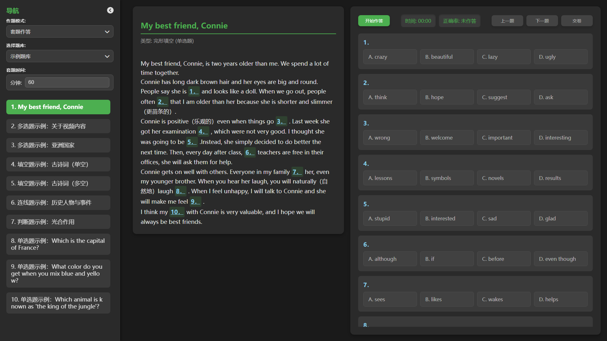
- 作答后
  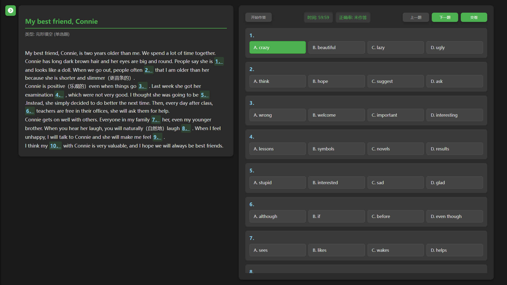
- 交卷与解析
  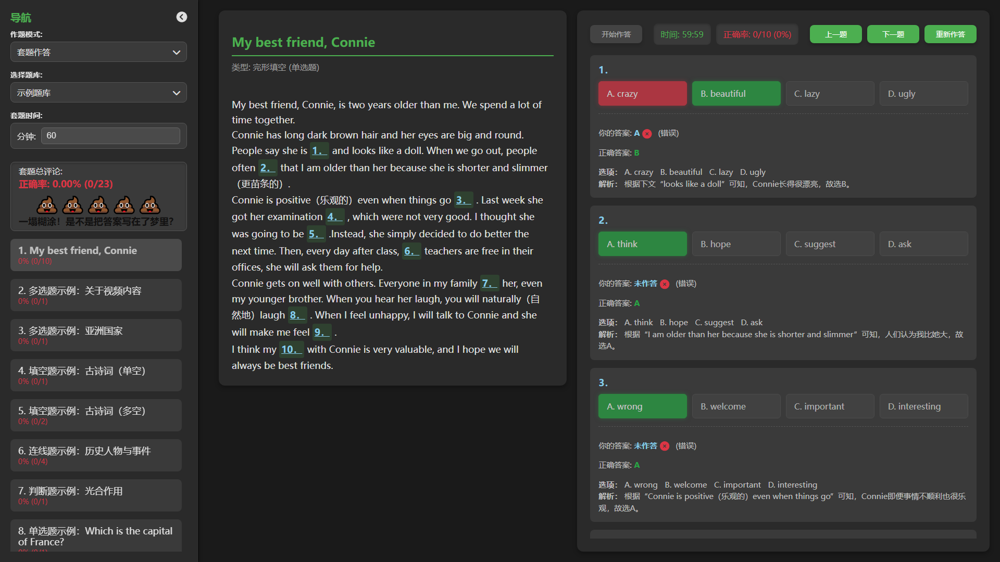

## 题型：single-choice

- 题型首页
  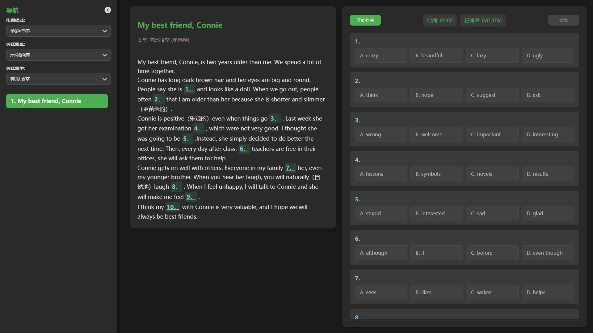
- 交卷与解析
  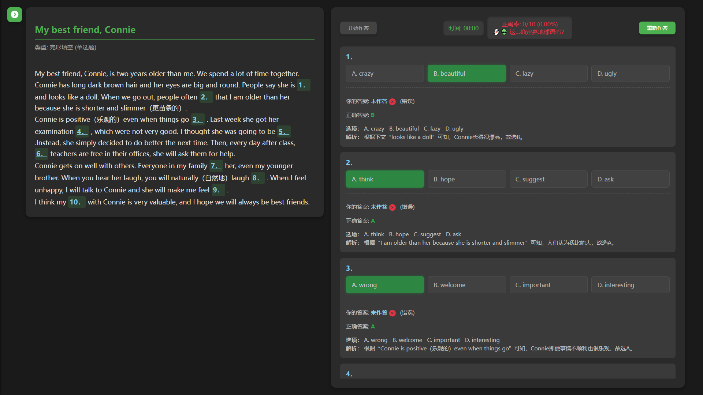

## 题型：multi-choice

- 题型首页
  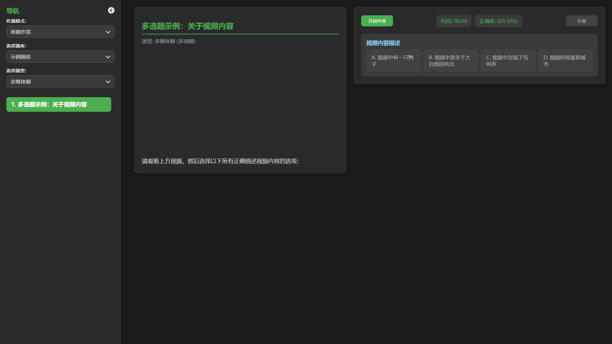
- 交卷与解析
  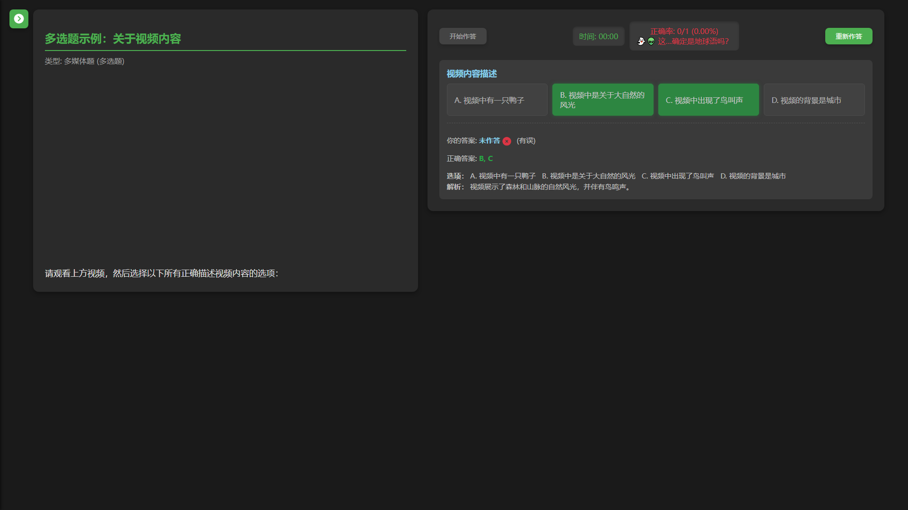

## 题型：fill-in-blank

- 题型首页
  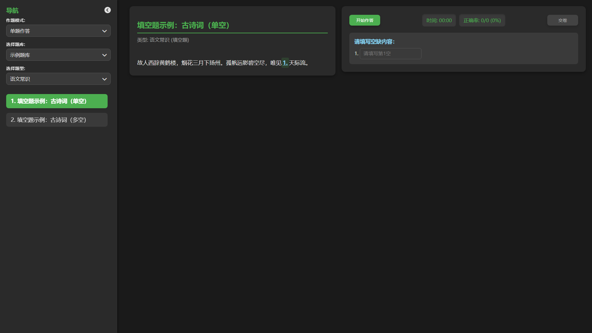
- 交卷与解析
  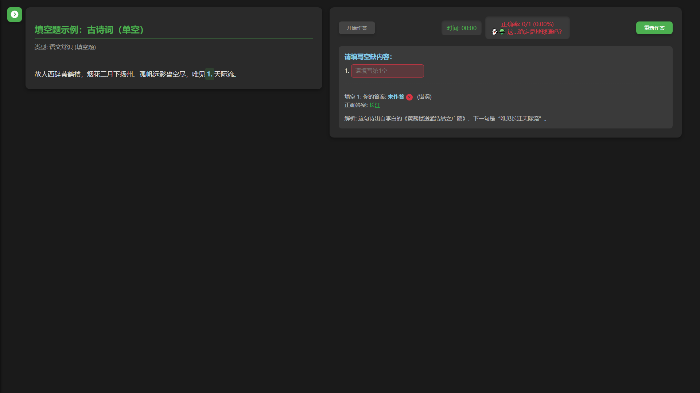

## 题型：matching

- 题型首页
  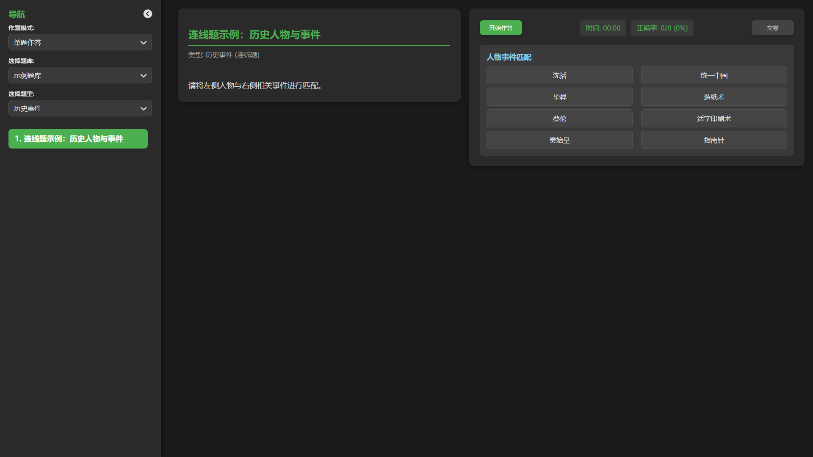
- 交卷与解析
  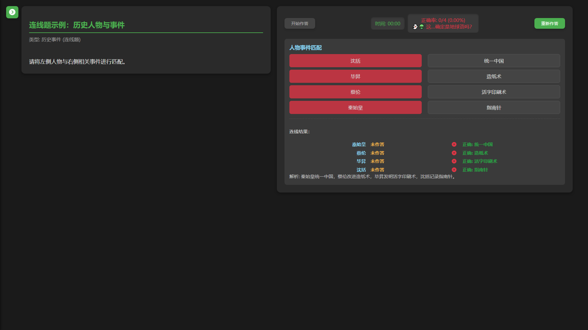

## 题型：true-false

- 题型首页
  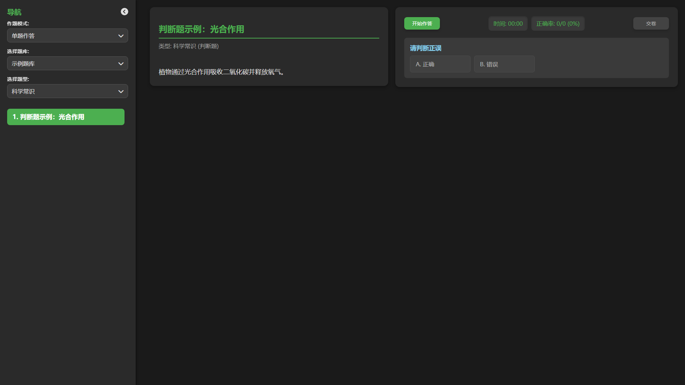
- 交卷与解析
  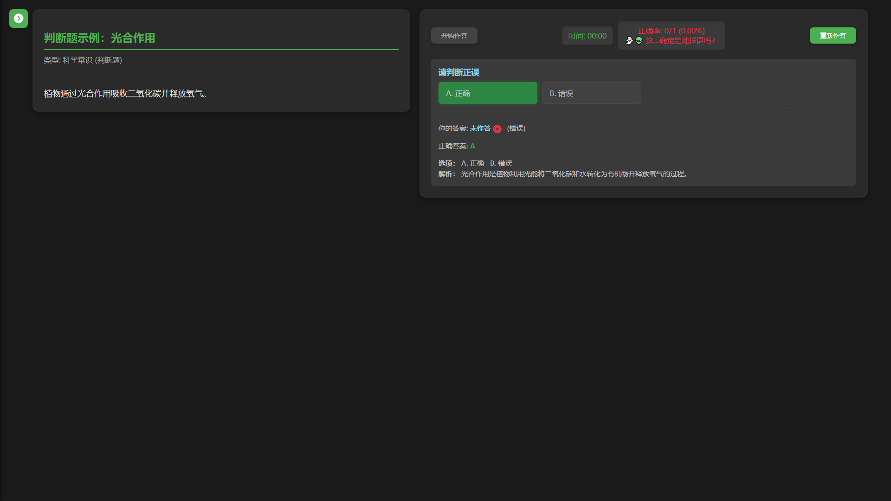
