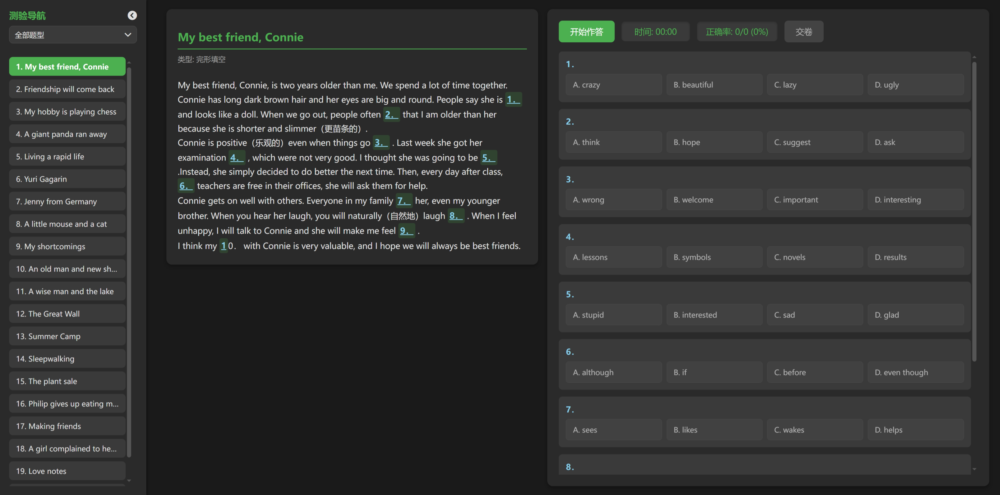
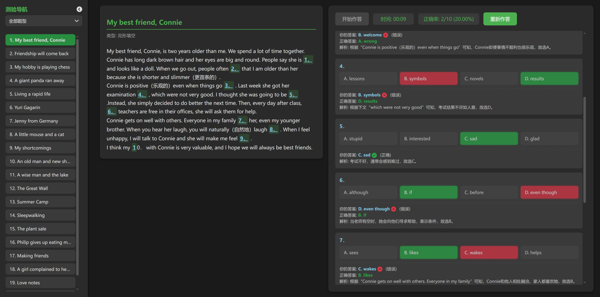
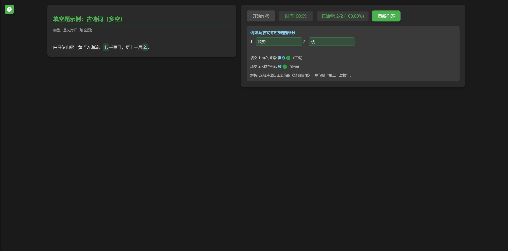
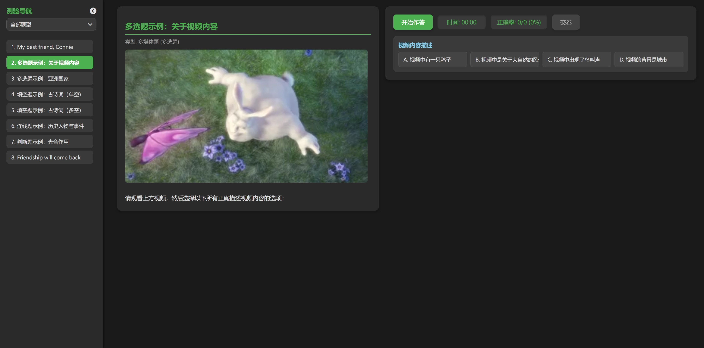
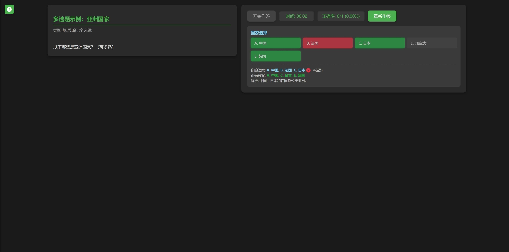
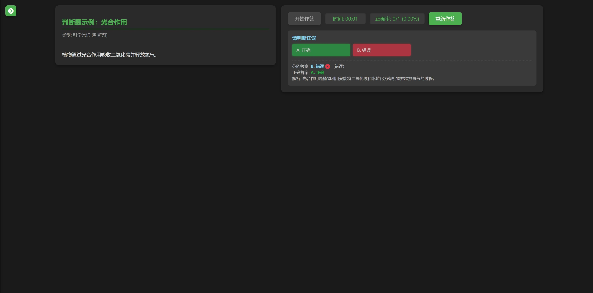
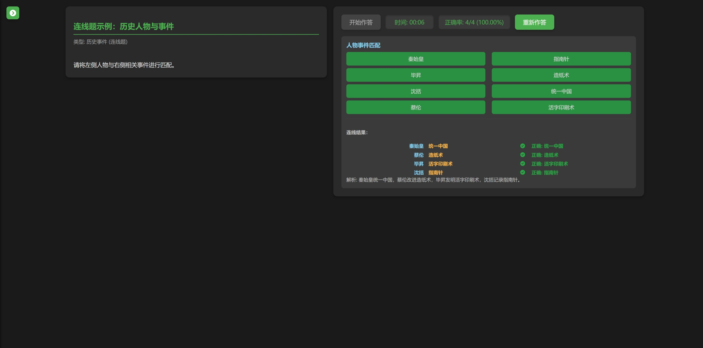

# 互动测验页面功能设计说明书

(主要页面)

（作答界，交卷后评改与分析，主要是维护题库）

视频题目

填空题目

多选题目

判断题

连线题

## 1. 引言

**本文档旨在详细阐述当前“互动测验页面”应用的功能需求和设计细节。该应用提供了一个用户友好的界面，用于进行多项选择题测验，并提供即时反馈和答案解析。本说明书将作为未来开发和维护的参考依据，确保应用功能的一致性和可重现性。**

## 2. 总体概述

**互动测验页面是一个基于Web的前端应用，通过加载本地JavaScript文件中的测验数据，为用户提供一个模拟测验环境。它包括测验列表导航、测验内容展示、实时计时、答案选择、即时批改、结果统计和答案解析等核心功能。应用采用响应式设计，适配不同尺寸的设备。**

## 3. 功能需求

### 3.1 测验加载与导航

* **数据源：** 应用通过 `` 加载测验数据。`quiz_data.js` 包含一个名为 `quizData` 的全局对象，该对象中有一个 `questions` 数组，每个元素代表一个独立的测验。
* **左侧测验列表：**
  * **页面左侧设有一个侧边栏，用于显示所有测验的标题列表（例如：“1. My best friend, Connie”）。**
  * **列表项文本格式为 “索引号. 测验标题”。**
  * **当测验标题过长时，将显示省略号（**`...`），并且鼠标悬停时会显示完整的题目名称（Tooltip）。
  * **列表支持垂直滚动，以便在测验数量较多时能够完整显示所有题目。**
  * **点击列表中的任何测验标题，右侧主内容区将加载并显示相应的测验内容。**
  * **当前选中的测验列表项会以绿色高亮显示 (**`.active` 类)。
  * **已完成的测验列表项会以较深的绿色显示 (**`.completed` 类)。
* **测验类型筛选：**
  * **在侧边栏顶部，新增一个“题目类型”下拉筛选器。**
  * **实现方式：** 该筛选器已由原生的 `<select>` 元素重构为**自定义的 HTML/CSS/JavaScript 组件****，以实现更精细的样式控制和一致的跨浏览器表现。**
  * **下拉框样式细节：**
    * **下拉框的背景颜色（**`#3a3a3a`）、边框（`1px solid #555`）、文字颜色（`#e0e0e0`）等完全可控，避免与页面背景融合。
    * **每个下拉选项（**`<li>`）具有清晰的背景色（`#444444`）、边框（`1px solid #5a5a5a;`）和底部分隔线（`1px solid #777777;`），确保选项之间有明确的视觉区分。
    * **下拉菜单展开时，整体有阴影效果（**`0 4px 8px rgba(0, 0, 0, 0.4)`），增强立体感。
    * **鼠标悬停在下拉选项上时，背景色会变为绿色（**`#4CAF50`），文字变为白色，提供直观的交互反馈。
  * **下拉菜单包含“全部题型”选项以及 **`quiz_data.js` 中所有独特的测验类型。
  * **选择不同的类型时，左侧的测验列表会实时更新，只显示匹配该类型的测验。**
* **侧边栏显示/隐藏：**
  * **侧边栏顶部包含一个“隐藏”图标（左箭头 **`fas fa-chevron-circle-left`），点击后侧边栏会向左滑出隐藏。
  * **侧边栏隐藏时，页面左上角会显示一个“显示”图标（右箭头 **`fas fa-chevron-circle-right`），点击后侧边栏会滑入显示。
  * **此功能在测验开始作答时会自动隐藏侧边栏，以便用户专注于测验内容。**
  * **显示/隐藏图标的样式已统一，使用统一风格的箭头图标，使其视觉更协调。**

### 3.2 测验内容显示

* **主内容区布局：** 页面右侧为主内容区，采用分栏布局，左侧显示测验文章，右侧显示作答选项及控制按钮。
* **测验标题和类型：** 显示当前加载测验的标题和类型。
* **测验文章：**
  * **文章内容支持多行显示，保留原始换行符。**
  * **文章中的题目序号（例如“1.”、“（7）”、“96.”）会进行高亮显示，并可点击。**
  * **点击高亮题目序号时，右侧的选项区域会自动滚动到对应题目位置，方便用户定位。**
* **作答选项：**
  * **每个小题的选项（A, B, C, D）以方块形式展示，排布整齐。**
  * **选项支持点击选择。**
  * **已选择的选项会有绿色背景高亮。**
  * **交卷后，正确答案显示深绿色背景，错误答案显示红色背景。**

### 3.3 测验交互与反馈

* **开始作答按钮：** 启动测验计时器，并启用所有选项供用户作答。
* **交卷按钮：**
  * **首次点击：停止计时，禁用选项，显示正确答案和错误答案，并展示每个小题的详细解析。同时，在左侧导航栏中标记该测验为“已完成”，并显示总得分和正确率。**
  * **再次点击：将当前测验重置为未作答状态，清除用户答案和解析，并重新启用“开始作答”按钮，允许用户重新进行该测验。**
* **计时器：** 显示测验已进行的时间。
* **正确率显示：** 实时显示用户已答题的正确率（例如“正确率: 0/0 (0%)”）。
* **答案解析：** 交卷后，每个小题下方会显示详细的答案解析，包括用户的选择（如果已作答）、正确答案以及详细的解释。

### 3.4 响应式设计

* **应用采用弹性布局和媒体查询，确保在不同屏幕尺寸（桌面、平板、手机）和方向下都能良好显示和操作。**
* **在较小的屏幕上，主内容区将由两栏布局自动变为单栏垂直堆叠布局。**

## 4. 技术栈

* **HTML5：** 页面结构。
* **CSS3：** 页面样式，包括自定义滚动条、响应式布局、以及自定义下拉组件样式。
* **JavaScript (ES6+)：** 测验逻辑、DOM 操作、事件处理、计时器功能和自定义下拉组件的交互逻辑。
* **Font Awesome：** 提供各种图标。

## 5. 数据结构 (`quiz_data.js`)

`quiz_data.js` 文件中的 `quizData` 对象结构如下：

新的数据库结构，参考new/quiz_data.js 多题型支持

## 6. 未来扩展性

* **后端集成：** 可以与后端服务集成，实现测验数据的动态加载、用户成绩的持久化存储、用户认证等功能。
* **更多题型：** 扩展支持除单项选择之外的其他题型，例如多项选择、填空题、简答题等。(已经完成)
* **用户管理：** 引入用户注册、登录、个人测验记录等功能。
* **测验配置：** 允许用户自定义测验时长、题目数量等参数。
* **高级统计：** 提供更详细的测验数据分析和可视化报告。
